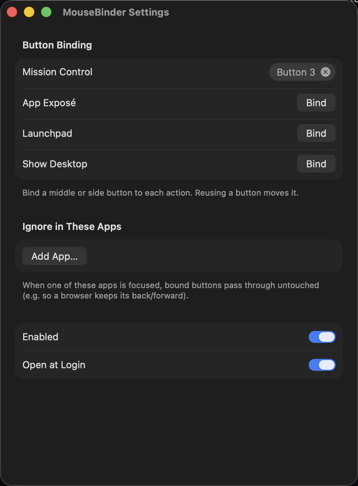
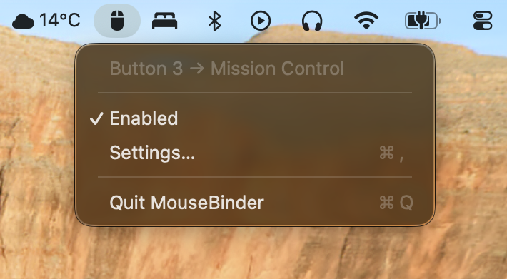

# MouseBinder

A macOS menu-bar app that binds extra mouse buttons (middle or side) to Mission Control, App Exposé, Launchpad, or Show Desktop.



## What it does

macOS has no built-in way to map a spare mouse button to Mission Control. MouseBinder adds one. You click Bind in its settings, press a mouse button, and that button now triggers the action.

- Binds middle click and any side button. Left and right click can't be bound.
- Four actions: Mission Control, App Exposé, Launchpad, Show Desktop.
- Keeps an ignore list. While a listed app is focused, bound buttons behave normally, so a browser can keep back/forward.
- Runs as a menu-bar item with an on/off toggle and an optional Open at Login setting.
- Rebuilds its event tap after sleep, wake, and fast user switching.
- Triggers actions through the Dock directly, so they work even if you changed or disabled the matching keyboard shortcuts.

## Install

With [Homebrew](https://brew.sh) (Apple silicon only):

```sh
brew install --cask ryanlewis/tap/mousebinder
```

Or manually:

1. Download the latest `MouseBinder-x.y.z.dmg` from [Releases](https://github.com/ryanlewis/mousebinder/releases). A `.zip` of the same app is attached too if you prefer.
2. Open the disk image and drag `MouseBinder.app` onto the Applications folder next to it. (For the zip: unzip it and move `MouseBinder.app` to `/Applications`.)
3. Open the app and grant Accessibility access when asked (System Settings → Privacy & Security → Accessibility). MouseBinder cannot see mouse buttons without it.

The app is signed and notarized. It requires macOS 15 or later.

## Usage



Click the mouse icon in the menu bar, then Settings. Each action row has a Bind button: click it, then press a mouse button within 8 seconds. If you bind a button that another action already uses, the button moves to the new action.

To exempt an app, add it under "Ignore in These Apps". While that app is focused, bound buttons keep their normal behaviour.

## How it works

MouseBinder installs a `CGEventTap` on `otherMouseDown` events, which is what the Accessibility permission is for. When you press a bound button, the app swallows the click and sends the Dock the same internal notification the system uses to trigger the action. It does not synthesise keyboard shortcuts, so your shortcut settings don't matter.

## Build from source

You need Swift 6 (ships with Xcode) and [just](https://github.com/casey/just).

```sh
git clone https://github.com/ryanlewis/mousebinder && cd mousebinder
just build                # builds and assembles MouseBinder.app (dev-signed)
open MouseBinder.app
```

`just build` signs with the best identity it finds: a Developer ID certificate if you have one (dev and release builds then share one Accessibility grant), otherwise the local certificate created by `just dev-cert` (grant survives rebuilds), otherwise ad-hoc (macOS re-asks for the Accessibility grant after every rebuild). If you rebuild often and have no Developer ID cert, run `just dev-cert` once. `just release` is the maintainer recipe for Developer ID signing and notarization; it produces both a zip and a DMG in `dist/`, each notarized and stapled. `just dmg` packages whatever `MouseBinder.app` is present into an unsigned DMG, handy for checking the image layout without credentials. Run `just` with no arguments to list all recipes.

## License

[MIT](LICENSE)
